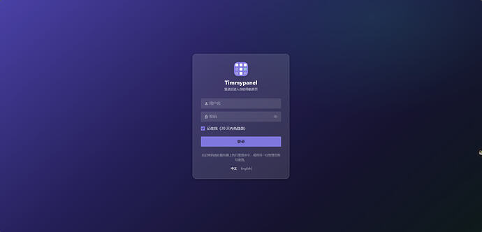
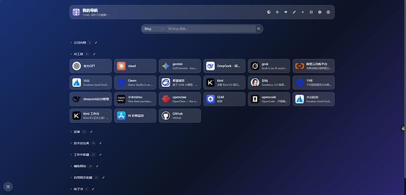
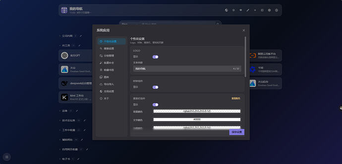

# Timmypanel

**A self-hosted start page: log in, and all the sites you actually use are one click away.**

[](LICENSE)


中文文档：[README.zh-CN.md](README.zh-CN.md)

Timmypanel is a private bookmark dashboard for a small number of trusted users — you, your
family, your homelab. It is **not** a public link directory: every page requires a login, and
each account sees only its own groups, cards, wallpapers and settings.

The whole thing ships as **one executable plus one SQLite file**. The Vue frontend is compiled
into the Go binary with `embed.FS`, so there is no Node runtime, no separate web server, and no
database to install. Copy the binary to a VPS, point a reverse proxy at it, done — or run the
prebuilt Docker image and skip even that.





## Features

**Getting your links in**

- **Bulk import** from pasted text, an exported browser-bookmarks HTML file, or JSON — all three
  show a preview before anything is written. Bookmark folders become groups.
- **Add one link** by pasting a URL and clicking *auto-fetch*: title, description and icon are
  filled in for you.
- **Batch backfill** icons and descriptions for cards you already have, filtered by group, with a
  progress bar you can stop halfway.
- **Bookmarklet** for sites the server cannot reach: drag it to your bookmarks bar, click it on
  any page, and your *browser* uploads the icon and title to the panel.

**Using them**

- **Card grid** grouped by category, collapsible, in either a flat or a tabbed layout. Drag to
  reorder or move between groups in edit mode.
- **Search** combines fuzzy matching over your own cards with a configurable set of external
  engines (Google, Bing, Baidu, …). Press `/` or `Ctrl+K` to focus.
- **Dual addresses**: give a card both a public and a LAN address (NAS, router, Proxmox) and flip
  the whole panel between them with one button.
- **Looks**: light/dark mode, image/solid/gradient wallpapers with blur and dimming sliders, and
  a media library of everything you have uploaded.
- **Bilingual UI**: Chinese and English, stored per account.
- **Mobile-friendly**: responsive layout, "add to home screen" support, floating group jump and
  back-to-top buttons.

**Keeping it yours**

- **Multiple accounts**, fully isolated from each other.
- **Backups**: export JSON (data only) or ZIP (data plus uploaded images); the server also keeps
  a daily snapshot. Importing takes a safety snapshot first.
- **Sessions**: "remember me" lasts 30 days, and you can list your logged-in devices and kick any
  of them off remotely.
- **Site-wide settings** for the admin: panel title, browser icon, login-page background.
- **No third-party requests at runtime.** Icon sets are bundled into the build, not fetched from
  a CDN; the page's `connect-src` is `'self'`.

## Quick start (Docker)

The image is built by CI and published to GHCR for both `amd64` and `arm64`, so a Raspberry Pi,
an Ampere instance or a Synology NAS all work. It is about 58 MB — Alpine plus one static binary,
running as uid 10001.

```bash
curl -fsSLO https://raw.githubusercontent.com/lovetimmy1314/timmypanel/main/docker-compose.yml
docker compose up -d
docker compose logs timmypanel     # the generated admin password is printed here
```

The panel is now on `127.0.0.1:8080`. **The port is deliberately published to the loopback
interface only** — put a reverse proxy in front of it for TLS (see below). Log in with the
password from the logs and change it immediately.

Upgrading keeps your data (it lives in the named volume `timmypanel_timmypanel-data`):

```bash
docker compose pull && docker compose up -d
```

Two commands too many, or juggling both deployment styles? [`deploy/update.sh`](deploy/update.sh)
collapses the upgrade into one: it checks whether the current directory has a compose file, falls
back to recreating the container the `docker run` way when it does not, and cleans up the image it
replaced.

```bash
curl -fsSLO https://raw.githubusercontent.com/lovetimmy1314/timmypanel/main/deploy/update.sh
chmod +x update.sh
./update.sh
```

A few things worth knowing:

- `latest` tracks the tip of `main`, not the newest release. Pin a version with
  `TP_TAG=1.2.3 docker compose up -d`. **Image tags have no `v` prefix** — git tag `v1.2.3`
  produces images `1.2.3` and `1.2`.
- Host port 8080 already taken? `TP_PORT=18080 docker compose up -d`.
- Don't set `TP_ADMIN_PASSWORD` to choose the first password: it would be written to
  `config.yaml` inside the volume in plain text. Read the random one from the logs instead.
- Back up the whole volume with:

  ```bash
  docker run --rm -v timmypanel_timmypanel-data:/data -v "$PWD":/out alpine \
    tar czf /out/timmypanel-backup.tar.gz -C /data .
  ```

Prefer a single command over a compose file? This is the same deployment without compose:

```bash
docker run -d --name timmypanel --restart unless-stopped \
  -p 127.0.0.1:8080:8080 \
  -v timmypanel-data:/data \
  -e TP_SECURE=true \
  -e TP_TRUSTED_PROXIES=172.17.0.1 \
  --stop-timeout 30 \
  ghcr.io/lovetimmy1314/timmypanel:latest

docker logs timmypanel     # the generated admin password is printed here
```

Neither environment variable is optional behind an HTTPS reverse proxy: without `TP_SECURE` the
session cookie loses its `Secure` flag, and without `TP_TRUSTED_PROXIES` a forged
`X-Forwarded-For` walks around the login rate limit. `172.17.0.1` is the usual default-bridge
gateway, but confirm it rather than trusting it — this is the one value compose does *not* share
with `docker run`, because the compose file pins its own subnet (`172.28.0.1`):

```bash
docker network inspect bridge -f '{{(index .IPAM.Config 0).Gateway}}'
```

Two more differences from the compose path: the volume is plain `timmypanel-data` with no project
prefix (adjust the backup command above accordingly), and upgrading is a recreate — the data
survives because it lives in the volume, not the container:

```bash
./update.sh     # the script above; with no compose file around it takes this path
```

By hand it is three steps. Use `stop`, not `rm -f`: the latter sends SIGKILL immediately, skipping
the backend's 10-second drain and SQLite's cleanup.

```bash
docker pull ghcr.io/lovetimmy1314/timmypanel:latest
docker stop -t 30 timmypanel && docker rm timmypanel
# then re-run the `docker run` above
```

See [`deploy/Dockerfile`](deploy/Dockerfile) for the full list of environment variables.

## Deploy without Docker (systemd + Caddy)

```bash
# 1. user and directories
sudo useradd -r -s /usr/sbin/nologin timmypanel
sudo mkdir -p /opt/timmypanel/data
sudo chown -R timmypanel:timmypanel /opt/timmypanel
```

```bash
# 2. upload the binary (run this locally)
scp dist/timmypanel-linux-amd64 root@your-server:/opt/timmypanel/timmypanel
```

```bash
# 3. install the service
sudo cp deploy/timmypanel.service /etc/systemd/system/
sudo chmod +x /opt/timmypanel/timmypanel
sudo systemctl enable --now timmypanel
sudo journalctl -u timmypanel -n 30    # the initial admin password is in here
```

```bash
# 4. reverse proxy with automatic HTTPS (edit the domain in the Caddyfile first)
sudo cp deploy/Caddyfile /etc/caddy/Caddyfile
sudo systemctl reload caddy
```

Then edit `/opt/timmypanel/data/config.yaml`: set `server.secure: true` (otherwise the session
cookie is sent without the `Secure` flag) and `server.trusted_proxies: ["127.0.0.1"]` (otherwise
a forged `X-Forwarded-For` header bypasses the login rate limit), and restart the service.

## Configuration

`data/config.yaml` is generated on first start, including a random secret and a random initial
admin password.

```yaml
server:
  listen: 127.0.0.1:8080     # loopback only; a reverse proxy faces the internet
  secure: true               # required under HTTPS, or the session cookie loses Secure
  trusted_proxies:           # empty = trust no proxy headers
    - 127.0.0.1
data:
  dir: ./data
auth:
  secret: ...                # generated on first start
  remember_days: 30          # lifetime of "remember me"
  initial_admin:
    username: admin
    password: ...            # only used while the database has no users at all
  allow_register: false      # keep false on the public internet; admins create accounts
fetch:
  allow_private: false       # allow fetching icons from private IPs (off: SSRF protection)
  timeout_sec: 8
backup:
  auto_daily: true
  keep: 7
```

Every deployment-relevant value can be overridden by an environment variable:
`TP_LISTEN`, `TP_SECURE`, `TP_DATA_DIR`, `TP_TRUSTED_PROXIES` (comma separated), `TP_SECRET`,
`TP_ADMIN_USER`, `TP_ADMIN_PASSWORD`, `TP_ALLOW_PRIVATE_FETCH`.

CLI flags: `-config <path>`, `-debug`, `-version`, `-reset-password <username>`.

## Forgot the admin password

> The `initial_admin.password` line in `config.yaml` is **dead weight once you have changed the
> password**. It is only consulted when the database contains no users at all, so the stale value
> sitting in the file will not log you in.

If another admin account exists, use it: *Account management* lets an admin set someone else's
password. Otherwise let the binary reset it — no need to stop the service or touch SQLite:

```bash
docker exec timmypanel /app/timmypanel -config /data/config.yaml -reset-password admin
```

```bash
sudo -u timmypanel /opt/timmypanel/timmypanel \
  -config /opt/timmypanel/data/config.yaml -reset-password admin
```

A new random password is printed on stdout and all existing sessions for that account are
destroyed. If you just tripped the rate limiter, wait out the 15-minute lockout or restart.

## Build from source

Requires Go 1.25+ and Node 20+.

```powershell
.\build.ps1 -Target all
```

Output lands in `dist/`: `timmypanel.exe` and `timmypanel-linux-amd64`. Because the SQLite driver
is pure Go (`modernc.org/sqlite`), `CGO_ENABLED=0` cross-compiles a Linux binary from Windows
with no C toolchain. `-Target windows|linux|all` selects platforms, `-SkipFrontend` rebuilds only
the Go side. On Windows you can also double-click `build.bat`, which is just an entry point for
the same script.

Building by hand is two steps in a fixed order, because the frontend output is a compile-time
dependency of the Go build:

```bash
cd frontend && npm ci && npm run build     # writes into backend/internal/web/dist
cd ../backend && go build -o timmypanel .  # embeds it
```

Docker images normally come from CI (`.github/workflows/docker.yml`, triggered by pushes to
`main` and `v*` tags, using the built-in `GITHUB_TOKEN`). To build one locally:

```bash
docker compose -f docker-compose.yml -f docker-compose.build.yml up -d --build
```

## Development

Two terminals:

```bash
cd backend && go run . -config ../data/config.yaml -debug
```

```bash
cd frontend && npm install && npm run dev
```

Open <http://localhost:5173>. The dev server proxies `/api` and `/uploads` to port 8080, so the
session cookie is same-origin. The backend prints the generated admin credentials on first start;
`TP_ADMIN_PASSWORD=... go run .` sets your own.

Checks to run before committing:

```bash
cd backend && gofmt -l . && go vet ./... && go test ./...
```

```bash
cd frontend && npm run typecheck
```

`npm run build` does **not** type-check, so `npm run typecheck` is not optional.

```
Timmypanel/
├── backend/
│   ├── main.go
│   └── internal/
│       ├── config/     config loading (yaml + TP_ env vars)
│       ├── model/      data models and migrations
│       ├── session/    server-side sessions (cookie holds a token, DB holds its hash)
│       ├── middleware/ auth, CSRF, login rate limiting
│       ├── service/    metadata fetching (SSRF protection), bookmark parsing
│       ├── api/        HTTP handlers
│       └── web/        the embedded frontend build
├── frontend/           Vue 3 + TypeScript + Vite + Naive UI + Tailwind
├── brand/              logo sources (SVG variants + preview page)
├── deploy/             systemd unit, Caddyfile, Dockerfile, update.sh
├── docs/               conventions, decision records, roadmap
└── data/               created at runtime: config.yaml, SQLite, uploads, backups
```

Three documents in [`docs/`](docs/) carry the context that the code cannot:

| File | Answers |
|---|---|
| [`conventions.md`](docs/conventions.md) | the rules this codebase writes code by |
| [`decisions.md`](docs/decisions.md) | why things are the way they are, and what each choice cost |
| [`plans.md`](docs/plans.md) | what is planned, what is deliberately out of scope, and the manual test checklist |

Read `decisions.md` before deleting anything that looks redundant. Several defensive details —
the hand-rolled SPA fallback, the CSP header on uploads, the dual drag-and-drop code path — are
there because removing them compiles and passes tests but breaks the running site.

## Security model

Timmypanel is designed to sit on the public internet with a login in front of it.

- **Sessions are server-side.** The cookie is `HttpOnly` and holds a 32-byte random token;
  the database stores only its SHA-256. Scripts cannot read it, and any session can be revoked.
  No JWT in `localStorage`.
- **Login attempts are rate limited** per IP *and* per username — 5 failures, 15 minute lockout.
  "No such user" and "wrong password" return the same message, so accounts cannot be enumerated.
- **Icon fetching is an attacker-influenced outbound request**, so private address ranges are
  refused by default. The check runs on the IP actually being dialled, which defeats DNS
  rebinding, and redirects, timeouts and response size are all capped.
- **Uploads are typed by content**, not by file extension — PNG/JPG/WebP/GIF only, stored under a
  random name.
- **`/uploads/*` requires a session** and serves only the current user's directory. Responses
  carry `Content-Security-Policy: sandbox`, so a fetched SVG icon cannot run scripts even if
  opened directly.
- **CSRF** is blocked by requiring an `X-Requested-With` header on every write, together with
  `SameSite=Lax` cookies.

Found a security problem? Please open a GitHub issue marked as such, or contact the maintainer
privately rather than posting a working exploit.

## Known limitations

- **No embedded iframes of your sites.** Most major sites send `X-Frame-Options: DENY`, so the
  feature would work for a small minority of cards.
- **No uptime monitoring.** Periodic probing drags in background jobs, timeouts and false alarms;
  it is not worth it for a start page.
- **Some sites still refuse to be scraped.** The fetcher uses a browser user agent and tries
  several icon candidates, which is enough for most sites, but Cloudflare's stricter tiers also
  inspect TLS fingerprints and IP reputation and will keep returning 403. Upload an icon manually.
- **The fetcher does not use a proxy.** Icons are downloaded by the *server*, not your browser,
  so a site your browser can open may still be unreachable from the machine running Timmypanel.
  Deploy somewhere with direct access to the sites you care about.

## Contributing

Issues and pull requests are welcome. Before opening a PR:

- read [`docs/conventions.md`](docs/conventions.md) — it only documents where this project differs
  from ordinary practice, and it is short;
- run the checks listed under [Development](#development);
- if your change touches auth, per-user isolation, uploads or fetching, walk the manual checklist
  at the end of [`docs/plans.md`](docs/plans.md);
- keep `backend/internal/web/dist/index.html` as the placeholder page. `npm run build` rewrites
  it, but the hashed asset files are not in version control, so committing the built page gives
  fresh clones a silent white screen. `git checkout -- backend/internal/web/dist/index.html`
  before committing.

Comments, logs and backend error messages are written in Chinese; identifiers and filenames are
ASCII. User-facing strings go through `frontend/src/i18n/`, which requires both a Chinese and an
English entry — a missing translation fails the type check.

## License

[GNU AGPL v3](LICENSE). You are free to use, modify and redistribute this software, but if you
run a modified version as a network service, you must offer its source to that service's users.
